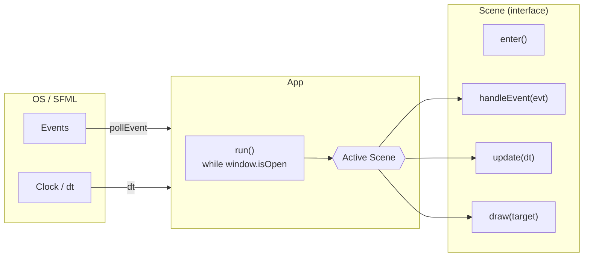
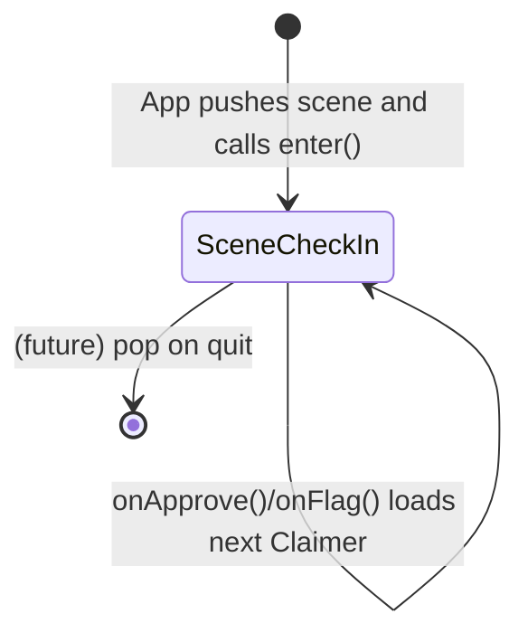
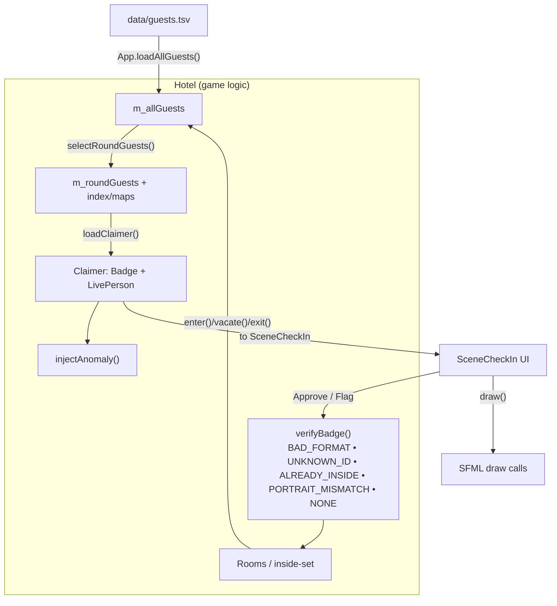

# Architecture Overview

This project is a small SFML game with a desk-only loop inspired by document-checking games. The core pieces are:
- **App**: boots the window, loads data, selects a round, runs the main loop, and dispatches to the active **Scene**.
- **SceneCheckIn**: the only scene today; renders the desk UI and handles Approve/Flag interactions.
- **Hotel**: game state & logic (guests/rooms/IDs/anomalies). Sources data from `data/guests.tsv` and produces a `Claimer` (badge + live portrait) for the scene to render.

## Main Loop (Runtime Control Flow)

**Notes**
- `App` owns the window and the scene stack. On startup: loads `data/guests.tsv`, asks `Hotel` to select a round, then pushes **SceneCheckIn** and calls `enter()`.
- Each frame: poll events → `handleEvent`, compute `dt` → `update`, then `draw`.

## Scene / State Management

**SceneCheckIn responsibilities**
- UI (buttons, hover/press SFX, labels, sprites)
- Data binding: `loadNextClaimer()` pulls from `Hotel::loadClaimer()` and updates on‑screen badge + live portrait
- Actions: `onApprove()` / `onFlag()` (currently just advance; TODO: hook into `Hotel::verifyBadge` outcome + logging/scoring)

## Data Flow (guests → validation → rendering)

**Validation path**
1. **SceneCheckIn** requests a new **Claimer** from **Hotel** → `Hotel::loadClaimer()` builds a `Badge` and a `LivePerson` from the selected round guest and may **injectAnomaly()**.
2. When the player makes a decision, the scene (future‑hook) asks **Hotel::verifyBadge(badge, live)** which checks:
   - bad ID format (non‑8‑digit),
   - unknown ID,
   - already inside,
   - portrait mismatch.
3. On success, **Hotel::enter(guestID)** assigns a room and records occupancy; on failure, the guest is denied (future: log/scoring).

## Key Structures (minimal mental model)
- **Guest / Badge / LivePerson / Claimer**: data for identity and on‑desk presentation.
- **Hotel**: owns round selection, verification rules, rooms, and current claimer lifecycle.
- **SceneCheckIn**: purely presentation + input; binds to current `Claimer` and renders it.
